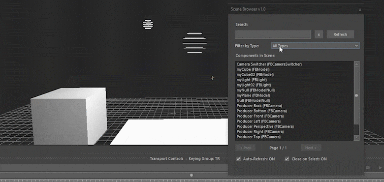
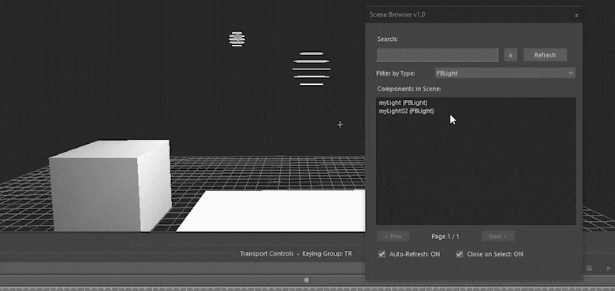
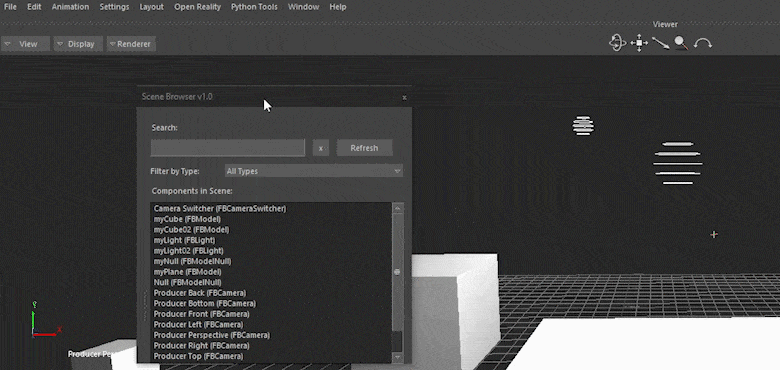

# Scene Browser Dialog
A quick and enhanced scene browser with a separate interface. 

Features include search, type filtering, real-time scene updates.

The window can also be docked.

# Platform
MotionBuilder : 2018 or above

OS : Windows / Linux

# Results
The Scene Browser can be called any time to quickly find and select a component in the current scene.

# Intended Usage
The Scene Browser can be used in any pipeline and workflow. 

The usage and outcome of the Scene Browser are very similar to that in the Navigator, however, to achieve the same effect in the Navigator window, the window needs to be open all the time, whereas, the Scene Browser can be called using any assigned shortcut key or a shelf button.

# Installation
1. The script can be run from the Python Editor inside MotionBuilder.
2. The script can be assigned to a shortcut key.
3. The script can be assigned to a custom shelf button.

# Usage
- Type the name of the component in the search bar to filter out the list of components present in the current scene.
  
  

  

- The list will auto-update any new component that is added to the scene. There is also a radio button to toggle this feature as well as a separate Refresh button for any kind of name changes.

  

- There is an option to filter out the type of the component.

  

  
- The Close on select toggle is also there to keep the window active even after selecting a component from the list. This will help while interchanging between selecting multiple components.

  

  - The option to select multiple objects in one go is under development.
 
- As always, the interface window can be docked anywhere on the MotionBuilder Layout.

  

# License

This project is licensed under the BSD 3-Clause License. See the LICENSE file for full details.

